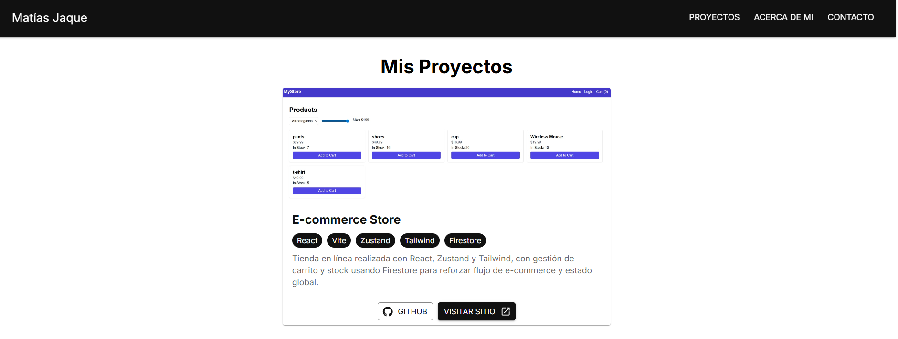
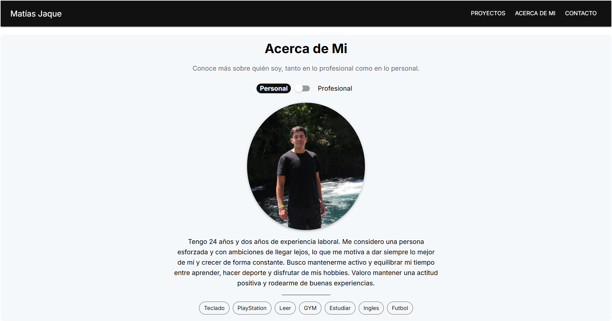
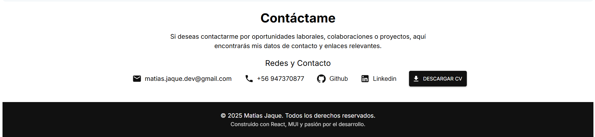

# 🚀 Portafolio de Matías Jaque

Este es mi portafolio profesional como desarrollador Front-End, para presentar mis proyectos, habilidades y experiencia de forma clara y profesional.

## 🖼️ Vista previa





## ✨ Características

✅ Diseño responsive adaptado a dispositivos móviles, tablet y escritorio.  
✅ Secciones claras: Proyectos, Acerca de mí, Contacto y Footer.  
✅ Tipografía limpia con Inter y paleta elegante blanco/negro.  
✅ Organización modular de componentes para fácil mantenimiento y escalabilidad.  
✅ Preparado para despliegue en Vercel.

## 🛠️ Tecnologías utilizadas

- **React**
- **Vite**
- **Material-UI (MUI)**
- **JavaScript**
- **HTML5 y CSS3**
- **Eslint y Prettier** para formato y calidad de código

## 🚀 Cómo ejecutar localmente

1️⃣ Clonar el repositorio:

```bash
git clone https://github.com/matiasjaque-dev/matiasjaque-portfolio.git
```

2️⃣ Instalar dependencias:

```bash
npm install
```

3️⃣ Ejecutar en desarrollo:

```bash
npm run dev
```

4️⃣ Abrir en navegador:

```bash
http://localhost:5173
```

📬 Contacto

Si deseas contactarme para oportunidades laborales o colaboraciones:

📧 matias.jaque.dev@gmail.com
📱 +56 947370877

Construido con pasión por el desarrollo y aprendizaje continuo.

¡Gracias por visitar mi portafolio!
